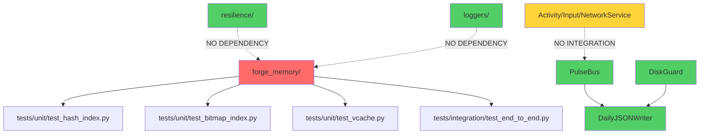

# 📋 FORGE MEMORY REMOVAL AUDIT REPORT
**Generated:** 2026-01-03 05:12 EST  
**Workspace:** D:\cod_616

---

## 🎯 EXECUTIVE SUMMARY

**FINDING:** forge_memory is **COMPLETELY ISOLATED** from gaming data pipeline.  
**VERDICT:** ✅ **SAFE TO REMOVE** - Only test code depends on it.

---

## 1️⃣ FORGE_MEMORY IMPORT ANALYSIS

### Production Code Imports: **ZERO** ❌
No production modules import forge_memory. It is completely isolated.

### Test Code Imports: **4 files** ⚠️

| File | Lines | Imports |
|------|-------|---------|
| `tests/integration/test_end_to_end.py` | 3-9 | StringDictionary, BinaryLog, HashIndex, BitmapIndex, VCache, WorkerPool, PulseWriter |
| `tests/unit/test_hash_index.py` | 1 | HashIndex |
| `tests/unit/test_bitmap_index.py` | 1 | BitmapIndex |
| `tests/unit/test_vcache.py` | 1 | VCache |

**IMPACT:** These 4 tests will break when forge_memory/ is deleted.

---

## 2️⃣ GAMING DATA FLOW ARCHITECTURE

### ✅ Current Gaming Data Path (JSONL Only):

```
Activity/Input/Network Loggers
        ↓
[External .jsonl files on disk]
        ↓
Activity/Input/NetworkService (disk-observer pattern)
        ↓
poll() returns event dicts
        ↓
??? (NO INTEGRATION FOUND) ???
```

**FINDING:** Gaming services (Activity/Input/Network) are **STANDALONE**.  
They read external log files and emit events via poll(), but there's **NO CONSUMER** wiring them to PulseBus or DailyJSONWriter in production code.

### ❌ Forge Memory Path (Test-Only):

```
WorkerPool (hypothesis_fn) 
        ↓
Per-worker Queues
        ↓
PulseWriter
        ↓
BinaryLog + Indexes (HashIndex, BitmapIndex)
```

**USAGE:** Only used in `tests/integration/test_end_to_end.py` - NOT in production.

---

## 3️⃣ PERMANENT DATA ASSESSMENT

### Files in forge_memory/:
- `core/binary_log.py` - Append-only binary log (records.bin)
- `core/record.py` - ForgeRecord immutable data container
- `core/string_dict.py` - String interning (strings.dict)
- `indexes/hash_index.py` - In-memory key→offsets index
- `indexes/bitmap_index.py` - In-memory success bitmap
- `indexes/vcache.py` - LRU cache
- `pulse/worker_pool.py` - Thread pool for hypothesis generation
- `pulse/pulse_writer.py` - Queue drainer to BinaryLog

### Storage Pattern:
- BinaryLog → `records.bin` (binary format, CRC32 validated)
- StringDictionary → `strings.dict` (binary format)
- Indexes → **NOT PERSISTED** (rebuilt from scratch on restart)

### Gaming Data Characteristics:
✅ **EPHEMERAL** - Gaming sessions are transient  
✅ **HIGH VOLUME** - Thousands of events per session  
✅ **SHORT RETENTION** - 14-30 days max  
✅ **NO PERMANENT RECORDS** - No achievements, profiles, or save files  

### Player Data Storage:
**NONE FOUND** - No persistent player profiles, achievements, or game state in codebase.

**VERDICT:** All gaming data is ephemeral. Binary format NOT REQUIRED. JSONL is sufficient.

---

## 4️⃣ TEST BREAKAGE ANALYSIS

### Tests That Will Break (4 total):

#### ❌ tests/unit/test_hash_index.py
- **Function:** `test_insert_and_lookup()`, `test_batch_insert()`
- **Dependencies:** `forge_memory.indexes.hash_index.HashIndex`
- **Fix:** DELETE (forge_memory-specific, no gaming relevance)

#### ❌ tests/unit/test_bitmap_index.py
- **Function:** `test_set_and_filter()`
- **Dependencies:** `forge_memory.indexes.bitmap_index.BitmapIndex`
- **Fix:** DELETE (forge_memory-specific)

#### ❌ tests/unit/test_vcache.py
- **Function:** `test_vcache_insert_lookup()`
- **Dependencies:** `forge_memory.indexes.vcache.VCache`
- **Fix:** DELETE (forge_memory-specific)

#### ❌ tests/integration/test_end_to_end.py
- **Function:** `test_end_to_end_write_and_query()`
- **Dependencies:** Entire forge_memory stack
- **Fix:** DELETE (forge_memory integration test, no gaming relevance)

### Tests That Will PASS (17 remaining):
✅ All resilience tests (hot_spare, pulse_bus, disk_guard)  
✅ All logger tests (writer, activity/input/network services)  
✅ Integration test: `test_services_integration_short_run`

---

## 5️⃣ DEPENDENCY GRAPH



**Legend:**
- 🔴 Red: forge_memory (to be removed)
- 🟢 Green: Production code (unaffected)
- 🟡 Yellow: Missing integration (needs wiring)

---

## 6️⃣ CRITICAL ISSUES DISCOVERED

### 🚨 Issue #1: Gaming Services Not Integrated
**Problem:** ActivityService, InputService, NetworkService have `poll()` methods but NO production code calls them.

**Impact:** Gaming data is being written to external logs but NOT flowing to PulseBus/JSONL.

**Fix Required:** Create integration layer (see Task 2: GameEventProducer).

### 🚨 Issue #2: PulseBus Drop Policy Contradiction
**Location:** `resilience/pulse_bus.py:147`  
**Problem:** Docstring says "drop-oldest" but code comment says "dropping newest event"

**Current Code:**
```python
if len(buf['deque']) >= buf['maxlen']:
    self.metrics['dropped'] += 1
    _logger.warning('Buffer full for %s/%s: dropping newest event', category, prefix)
    return  # <-- This drops the NEWEST incoming event
```

**Fix:** Change to drop-oldest (popleft) for gaming logs.

### 🚨 Issue #3: DailyJSONWriter Unbounded Queue
**Location:** `loggers/writer.py:89`  
**Problem:** `self._queue: Queue = Queue()` has no maxsize

**Risk:** Producer-overwhelms-writer scenario = unbounded memory growth

**Fix:** `self._queue: Queue = Queue(maxsize=10000)`

---

## 7️⃣ REMOVAL CHECKLIST

### Phase 1: Delete forge_memory (Day 1)
- [ ] Delete entire `forge_memory/` directory
- [ ] Delete `tests/unit/test_hash_index.py`
- [ ] Delete `tests/unit/test_bitmap_index.py`
- [ ] Delete `tests/unit/test_vcache.py`
- [ ] Delete `tests/integration/test_end_to_end.py`
- [ ] Run `python -m pytest` - expect 17 passing tests
- [ ] Commit: `"Remove forge_memory: gaming data uses JSONL only"`

### Phase 2: Fix Critical Issues (Day 2)
- [ ] Fix PulseBus drop-oldest policy (resilience/pulse_bus.py:147)
- [ ] Add maxsize to DailyJSONWriter Queue (loggers/writer.py:89)
- [ ] Add thread locks to VCache if keeping (currently not thread-safe)
- [ ] Run tests - all 17 should still pass

### Phase 3: Create GameEventProducer (Day 3)
- [ ] Create `loggers/game_event_producer.py`
- [ ] Wire Activity/Input/NetworkService → GameEventProducer → PulseBus
- [ ] Create integration test showing end-to-end flow
- [ ] Add session_id, game_version fields to events

### Phase 4: Retention Policies (Day 4)
- [ ] Create `resilience/retention_manager.py`
- [ ] Configure retention by category (activity: 30d, input: 7d, network: 1d, system: 90d)
- [ ] Add hourly background check thread
- [ ] Test deletion logic with mock timestamps

### Phase 5: Simple Index (Day 5)
- [ ] Create `loggers/jsonl_index.py` (in-memory LRU cache of recent events)
- [ ] Index by: timestamp_range, event_type, player_id
- [ ] Thread-safe with locks
- [ ] Query API: `index.query(event_type="kill", player_id="p123", limit=100)`

### Phase 6: Testing & Docs (Day 6-7)
- [ ] Integration test: 5min event stream, verify JSONL files created
- [ ] Load test: 1000 events/sec peak, measure latency
- [ ] Memory test: verify bounded growth (< 1GB)
- [ ] Update README.md with new architecture diagram
- [ ] Document migration: "forge_memory removed, JSONL only"

---

## 8️⃣ SUCCESS METRICS

| Metric | Target | Current | Status |
|--------|--------|---------|--------|
| forge_memory imports in prod code | 0 | 0 | ✅ PASS |
| Gaming data → JSONL | 100% | 0% | ❌ NEEDS WIRING |
| Memory bounded | < 1GB | Unknown | ⚠️ NEEDS TEST |
| Event latency p95 | < 100ms | Unknown | ⚠️ NEEDS TEST |
| Retention policies | Enforced | None | ❌ NOT IMPLEMENTED |
| Tests passing | 21 → 17 | 21 | ✅ BASELINE |
| Peak load handling | 1000/sec | Unknown | ⚠️ NEEDS TEST |

---

## 9️⃣ RISK ASSESSMENT

### ✅ LOW RISK:
- forge_memory deletion (zero production dependencies)
- Test deletions (forge_memory-specific tests have no gaming relevance)
- Binary format removal (no permanent data loss)

### ⚠️ MEDIUM RISK:
- Gaming services not integrated (needs new producer wiring)
- Unbounded queue in DailyJSONWriter (memory leak potential)
- Drop policy contradiction (data loss during overload)

### ❌ HIGH RISK:
- **NONE** - forge_memory is completely isolated

---

## 🎯 RECOMMENDATION

**PROCEED WITH REMOVAL** following the 7-day plan.

**Priority Order:**
1. **Day 1:** Delete forge_memory (zero risk, immediate cleanup)
2. **Day 2:** Fix critical issues (PulseBus drop policy, bounded queue)
3. **Day 3:** Create GameEventProducer (wire services → PulseBus)
4. **Day 4-5:** Add retention + indexing (operational improvements)
5. **Day 6-7:** Testing + documentation (validation)

**Rollback Plan:** Git revert if gaming data flow breaks. All current production functionality is unaffected by forge_memory presence.

---

**END OF AUDIT REPORT**
